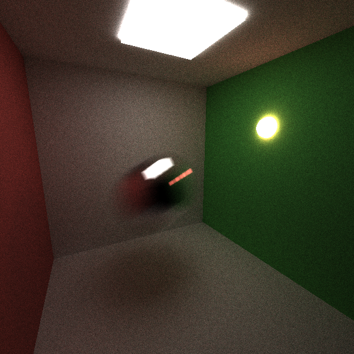

CUDA Path Tracer
================

**University of Pennsylvania, CIS 565: GPU Programming and Architecture, Project 3**

* Ottavio Hartman
* Tested on: Windows 7, Xeon E5-1630 @ 3.70GHz 32GB, GTX 970 4GB (SIG Lab)

## Features
#### Stream compaction
#### First intersection caching
One of the easiest things to cache in a pathtracer is the first-bounce intersection point. While this efficiency can be implemented simply, it relies on some conditions which other features may break: for example, motion blur does not allow for first-bounce caching because the objects in the scene may move.

In `pathtrace.cu`, there is a toggle `CACHE_FIRST_BOUNCE` which changes whether or not the first intersection is cached. The performance data is as follows:

There is a clear improvement with caching the first intersection, but it is also important to see that the performance benefit shrinks as the depth increases. For 2 bounces, there was a __22.3%__ increase in speed, 8 bounces had a __8.46%__ increase, and 16 bounces had a __8.42%__ increase.

If intersection caching were implemented on the CPU, it would be much slower. This feature is really meant for the GPU because it is already being used to calculate all of the intersections; there is no point in moving the code to the CPU just to cache the first intersections.

Further optimization could use the topics learned in class to more efficiently store the cached intersections. I did not pay any attention to the order in which memory was accessed--that is, global memory may be getting retrieved at random, non-contiguos locations. This is a huge performance hit which could be reduced with regard to how global memory is retrieved.

#### Motion blur
I implemented a way to describe the translational and rotational motion of objects in the scene, as well as a motion blur. There is no "shutter speed" or anything like that; it simply blurs the objects over the entirety of their movement. The `T_MOTION` and `R_MOTION` in the `*.txt` scene files describe the __relative__ motion from the starting transformation.

#### Textures
##### Procedural
##### Bump mapping
Overview write-up of the feature
Performance impact of the feature
If you did something to accelerate the feature, what did you do and why?
Compare your GPU version of the feature to a HYPOTHETICAL CPU version (you don't have to implement it!) Does it benefit or suffer from being implemented on the GPU?
How might this feature be optimized beyond your current implementation?

